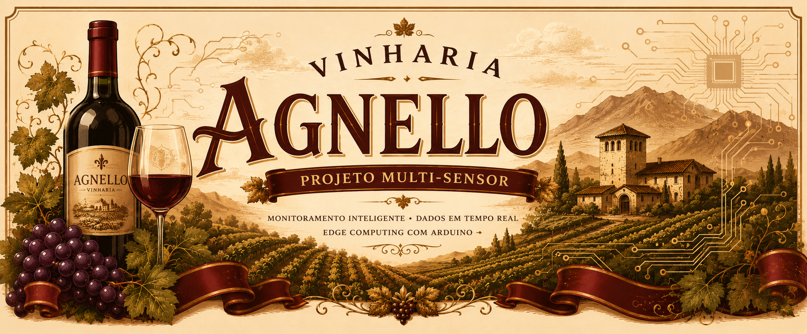
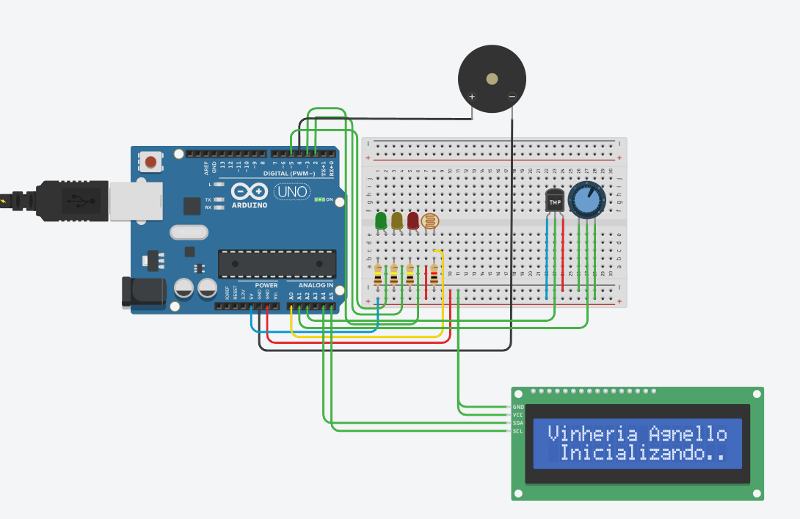
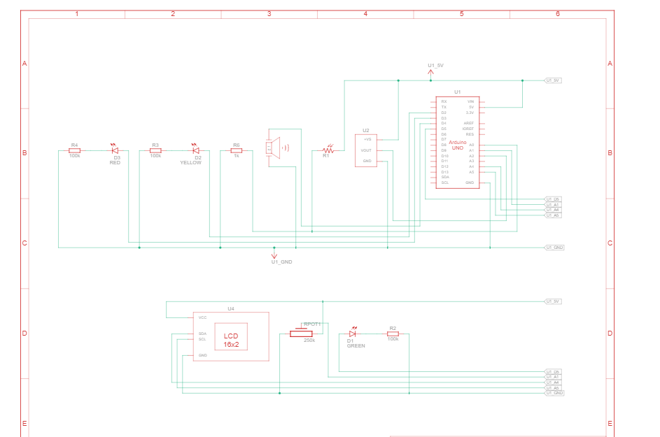

  

  

  

<h1 align="center">
🍷 Vinheria Agnello  
</h1>

<h2 align="center">
📡 Sistema Completo de Monitoramento Ambiental
</h2>

Sistema embarcado em Arduino Uno integrando <b>LDR</b>, <b>DHT11</b> e <b>Display LCD</b> para monitoramento ambiental inteligente de vinherias.

---

### 📋 Descrição do Projeto

Este projeto consiste em um sistema completo de monitoramento ambiental utilizando sensores **LDR** (luminosidade) e **DHT11** (temperatura e umidade) conectados a um **Arduino Uno**. O sistema lê continuamente os parâmetros climáticos do ambiente da vinheria, exibe dados em tempo real em um **Display LCD 16x2 I2C** e aciona um conjunto de LEDs coloridos e um buzzer para alertar sobre condições que possam comprometer a conservação dos vinhos

### 📦 Dependências

#### 🛠️ Lista de Componentes

| Identificador | Qtd | Componente | Função no Projeto |
|:-------------:|:---:|:-----------|:------------------|
| U1 | 1 | Arduino Uno | Placa controladora principal |
| U2 | 1 | Sensor DHT11 | Medição de temperatura e umidade |
| U4 | 1 | Display LCD 16x2 I2C | Exibição dos dados em tempo real |
| R1 | 1 | Fotorresistor (LDR) | Sensor de luminosidade ambiente |
| R2, R3, R4 | 3 | Resistor 100 kΩ | Limitação de corrente / Pull-up |
| R6 | 1 | Resistor 1 kΩ | Divisor de tensão para LDR |
| D1 | 1 | LED Verde | Indicador de ambiente ideal |
| D2 | 1 | LED Amarelo | Indicador de nível de atenção |
| D3 | 1 | LED Vermelho | Indicador de nível crítico |
| PIEZO1 | 1 | Buzzer | Alarme sonoro em condições críticas |
| — | 1 | Protoboard | Base para montagem do circuito |
| — | — | Jumpers | Conexões entre componentes |

#### ⚙️ Tecnologias Utilizadas

- 
- 
- 

## 📌 Nota 
Na simulação do Tinkercad, o componente DHT11 não está disponível. Por isso, utilizamos sensores analógicos equivalentes (LM35 para temperatura e sensor de umidade analógico) para validar a lógica do sistema. No protótipo físico real, o código seria adaptado para usar a biblioteca DHT.h com o sensor digital DHT11, mas a lógica de monitoramento e alertas permanece a mesma.

### 📚 *Bibliotecas*

> 🔴 **ATENÇÃO:** Este projeto utiliza bibliotecas externas obrigatórias. Sem elas, o código não compilirá.

### 1. Biblioteca DHT Sensor Library
Utilizada para comunicar com o sensor de temperatura e umidade.
*   **Nome na IDE:** `DHT sensor library` (por Adafruit)
*   Como instalar: *IDE Arduino → Sketch → Incluir Biblioteca → Gerenciar Bibliotecas → Buscar por "DHT" → Instalar*

### 2. Biblioteca LiquidCrystal_I2C
Utilizada para controlar o Display LCD através de apenas 2 fios (I2C).
*   **Nome na IDE:** `LiquidCrystal_I2C` (por Frank de Brabander)
*   Como instalar: *IDE Arduino → Sketch → Incluir Biblioteca → Gerenciar Bibliotecas → Buscar por "LiquidCrystal I2C" → Instalar*

> 💡 *Dica: Após instalar a biblioteca do DHT, a própria IDE pode pedir para instalar dependências adicionais (Adafruit Unified Sensor). Aceite a instalação.*

---

### 📐 Diagramas
| Link Tinkercard |
| :---------------------------------------: |
| [Clique aqui para acessar!](https://www.tinkercad.com/things/lsez4V5MCBO-multi-sensor-vinheriaagnello-offgrid) |

#### 🖼️ Diagrama do Circuito

#### 🖼️ Diagrama Esquemático

### 🎥 Explicação

| Link |
| :------------: |
| link aqui |

### 👥 Partipantes

| Nomes         | RM             |
| :-------------| :------------: |
| Felipe Rabelo |  570340
| Gustavo Ferreira Tavares | 569928 |
| Ricardo Salmerón | 572916 |